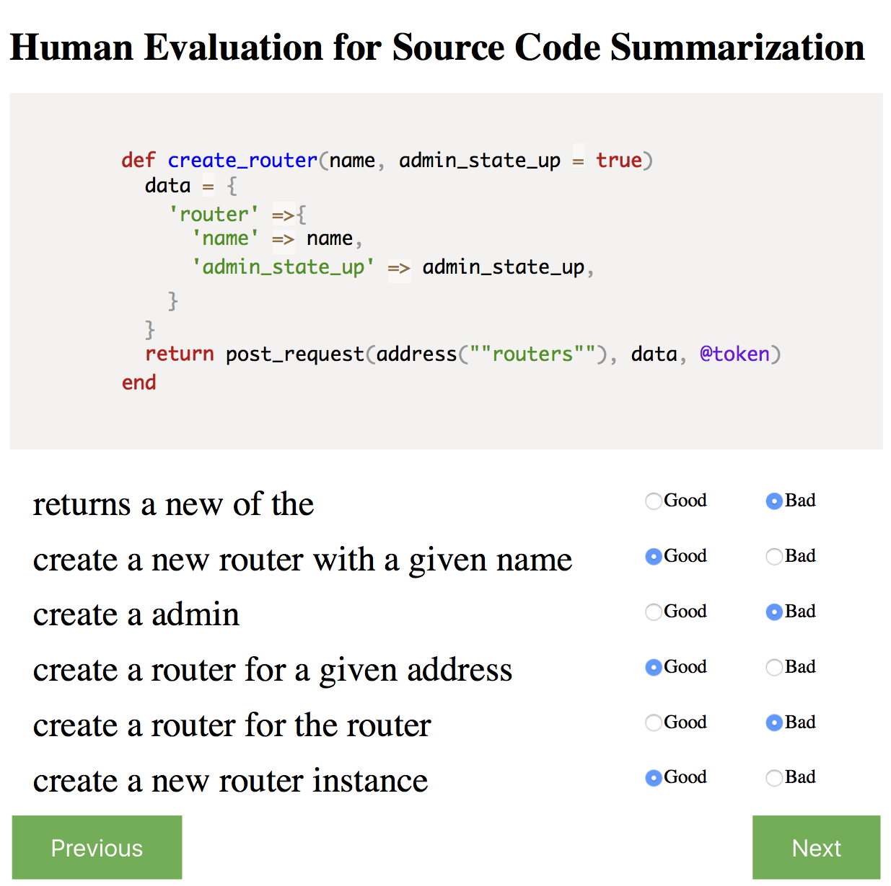

# ASE2020-[code-sum-meta]

This repos. archives the source code and dataset for our code-sum-meta, which has been submitted to ASE'20 for review.


## Dataset
Here, we only release 1,000 data examples of each language for review. We'll release the whole dataset as our paper is accepted.

### A python example
code:
```
"def bulk_load(self, table, tmp_file):\n        \"\"\"\n        Loads a tab-delimited file into a database table\n        \"\"\"\n        self.copy_expert(\"COPY {table} FROM STDIN\".format(table=table), tmp_file)"
```
code tokens:
```
["def","bulk_load","(","self",",","table",",","tmp_file",")",":","self",".","copy_expert","(","\"COPY {table} FROM STDIN\"",".","format","(","table","=","table",")",",","tmp_file",")"]
```
our code tokens:
```
["def","bulk","load","(","self",",","table",",","tmp","file",")",":","self",".","copy","expert","(","\"copy {table} from stdin\"",".","format","(","table","=","table",")",",","tmp","file",")"]
```
docstring:
```
"Loads a tab-delimited file into a database table"
```
comment:
```
["loads","a","tab","-","delimited","file","into","a","database","table","."]
```
paths:
```
[
[["\""],["\"_operator","string","attribute","call","argument_list",")_operator"],[")"]],[["\""],["\"_operator","string","attribute","call","argument_list","keyword_argument","=_operator"],["="]],
...
]
```


## Command

```
python -u ./run/summarization/xlang/maml/main.py
```

1. Meta-learning train

Before running this command, please revise the Argues line in main.py as follows.
```
Argues = namedtuple('Argues', 'yaml task lang_mode method_name train_mode dataset_type')
args = Argues('adam-sgd.yml', 'summarization', 'xlang', 'maml', 'train_maml', 'all', )
```
2. Fine-tuning after meta-learning
Change the configuration files path.
```
args = Argues('./ruby/tok8path-p1.0.yml', 'summarization', 'xlang', 'maml', 'train_maml_ft', 'target', )
```
3. Self-Critical training after fine-tuning
```
args = Argues('./ruby/tok8path-p1.0.yml', 'summarization', 'xlang', 'maml', 'train_maml_sc', 'target', )
```
4. Evaluate model after fine-tuning or self-critical training
```
args = Argues('./ruby/tok8path-p1.0.yml', 'summarization', 'xlang', 'maml', 'test', 'target', )
```

## Human Evaluation Page




## Notes
This repos. is only for review, please don't distribute it. Thanks.


